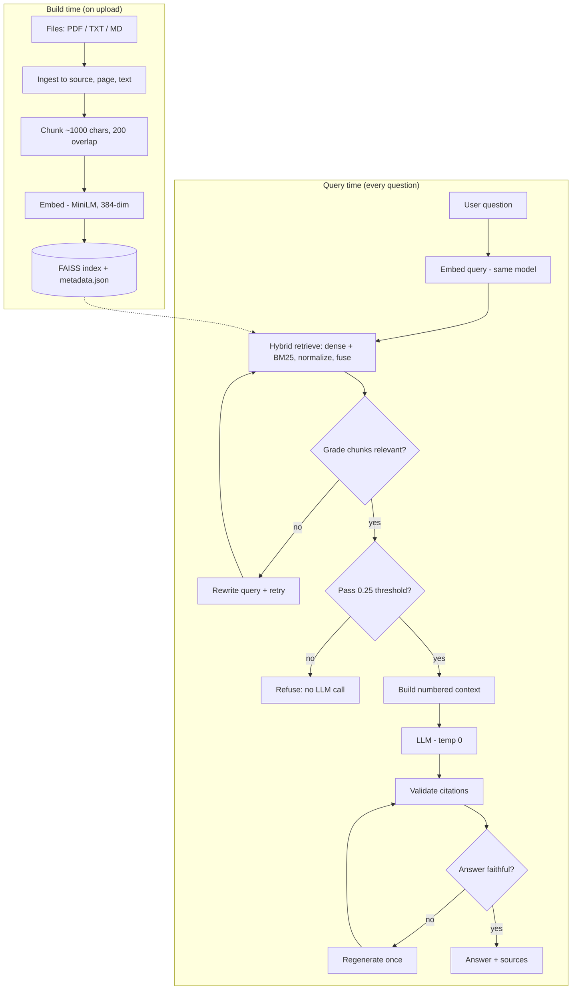

# 🧠 BrainVault

A local, citation-grounded **RAG (Retrieval-Augmented Generation)** system: upload your documents, ask questions, and get answers drawn **only** from your files — with source-and-page citations, hybrid search, a self-correcting reflection loop, and a built-in evaluation harness.

Unlike pasting text into a chatbot, BrainVault searches across a whole library of documents, cites exactly where each answer came from, and **refuses to answer** when it can't find support — so it doesn't hallucinate.

---

## ✨ Features

- **Hybrid retrieval** — combines dense semantic search (FAISS + MiniLM embeddings) with sparse keyword search (BM25), so it catches both *meaning* ("young dog" → "puppy") and *exact terms* (error codes, names, IDs).
- **Self-reflective loop** — grades retrieved chunks before answering (rewriting the query if they're weak) and critiques the answer's faithfulness afterward (regenerating if it's unsupported). Every critic **fails open** so it can never break a request.
- **Evaluation harness** — measures retrieval quality (recall@k, hit@k, MRR) and answer quality, and A/B-tests baseline vs. reflection so improvements are *measured*, not guessed.
- **Grounded answers with citations** — every answer cites `[1] [2]` mapping to a real source file and page range.
- **OCR fallback** — fully-scanned PDFs are sent to Sarvam's document-intelligence API when normal text extraction finds nothing.
- **Background indexing** — uploads reindex on a background thread so the UI never freezes.

---

## 🏗️ Architecture



**Two models, never confused:** the *embedding model* (MiniLM) makes vectors; the *LLM* (DeepSeek via OpenRouter) writes answers.

---

## 🔁 How a query flows (in plain terms)

1. **Ask** — the question hits the engine.
2. **Find** — hybrid search retrieves candidate chunks (semantic + keyword, fused).
3. **Check the chunks** *(before the LLM)* — a cheap score threshold refuses junk; the reflection grader rewrites-and-retries if chunks are weak.
4. **Answer** — good chunks + a "use only these" prompt go to the LLM.
5. **Check the answer** *(after the LLM)* — citations are validated and the critic verifies faithfulness (regenerating once if needed).
6. **Show** — the answer renders with its cited sources.

---

## 📊 Evaluation

BrainVault ships an evaluation harness (`evaluation/`) that scores **retrieval** and **answers** separately and A/B-tests the reflection layer, so gains are measured rather than assumed.

**What it measures**
- *Retrieval* (no API key needed): `recall@k`, `hit@k`, `mrr` — did the right documents come back?
- *Answers* (needs `OPENROUTER_API_KEY`): grounding accuracy, refusal accuracy, hallucination rate — baseline **vs.** reflection.

**Reproduce on your own documents**
```bash
# 1. build an index from your docs
python build_index.py

# 2. write ~10-30 Q&A pairs (schema in evaluation/eval_questions.sample.json)
#    then run the A/B benchmark:
python -m evaluation.compare_reflection evaluation/eval_questions.json

# offline unit tests for the metrics/harness (no key):
python -m pytest tests/test_metrics.py tests/test_harness.py -q
```
The runner prints a baseline-vs-reflection table and writes `evaluation/ab_results.json`. Drop your numbers into the table below once you have them.

<!-- Paste your measured results here, e.g.
| Metric | Baseline | + Reflection |
|---|---|---|
| Refusal accuracy | 0.62 | 0.91 |
| Hallucination rate | 0.18 | 0.04 |
| Retrieval recall@5 | 0.80 | — |
-->

---

## 🛠️ Tech stack

- **Retrieval:** FAISS (`IndexFlatIP`), `sentence-transformers` (`all-MiniLM-L6-v2`), `rank-bm25`
- **LLM:** DeepSeek R1 via OpenRouter (swappable by config)
- **OCR:** Sarvam AI document-intelligence (fallback for scanned PDFs)
- **API/UI:** FastAPI + a vanilla HTML/JS front end
- **Config:** single `config.yaml` (all tunable knobs)

---

## 🚀 Getting started

```bash
git clone https://github.com/sarthak742/brainvault.git
cd brainvault
python -m venv .venv && source .venv/bin/activate    # Windows: .venv\Scripts\activate
pip install -r requirements.txt
cp .env.example .env      # then add your OPENROUTER_API_KEY (and SARVAM_API_KEY for OCR)
python app.py             # open http://localhost:8000
```

---

## ⚙️ Configuration (`config.yaml`)

Key knobs: `chunk_size` (1000), `chunk_overlap` (200), `default_k` (5), `score_threshold` (0.25), `hybrid_alpha` (0.5, dense vs BM25), `embedding_model`, and the `reflection_*` toggles. All are documented inline.

---

## 🧭 Known limitations & roadmap

- **Full rebuild on every upload** — should be *incremental* (only embed new chunks).
- **Brute-force search** (`IndexFlatIP`) is exact but O(n); at millions of chunks, move to an approximate index (IVF/HNSW).
- **Single-process, in-memory** — for real concurrency, externalize the index to a vector DB.
- **OCR triggers per-document, not per-page** — a mostly-text PDF with one scanned page won't OCR that page.
- **No reranker yet** — a cross-encoder over the top-k would sharpen results.
- **Threshold on hybrid scores is relative** (post-normalization), so it's a softer guard than on the pure-dense path.

---

## 📁 Project structure

```
ingestion/    read files + OCR fallback to PageRecords
chunking/     paragraph-aware chunker
embeddings/   MiniLM embedder
vectorstore/  FAISS index + metadata (save/load)
retrieval/    dense, BM25, hybrid fusion
llm/          answer engine + OpenRouter client
reflection/   retrieval grader, query rewriter, answer critic
evaluation/   metrics + A/B harness
app.py        FastAPI web app   .   main.py  CLI
```
